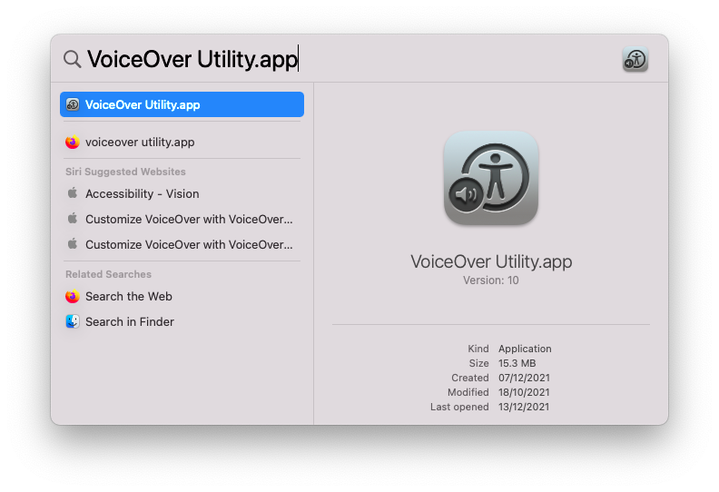
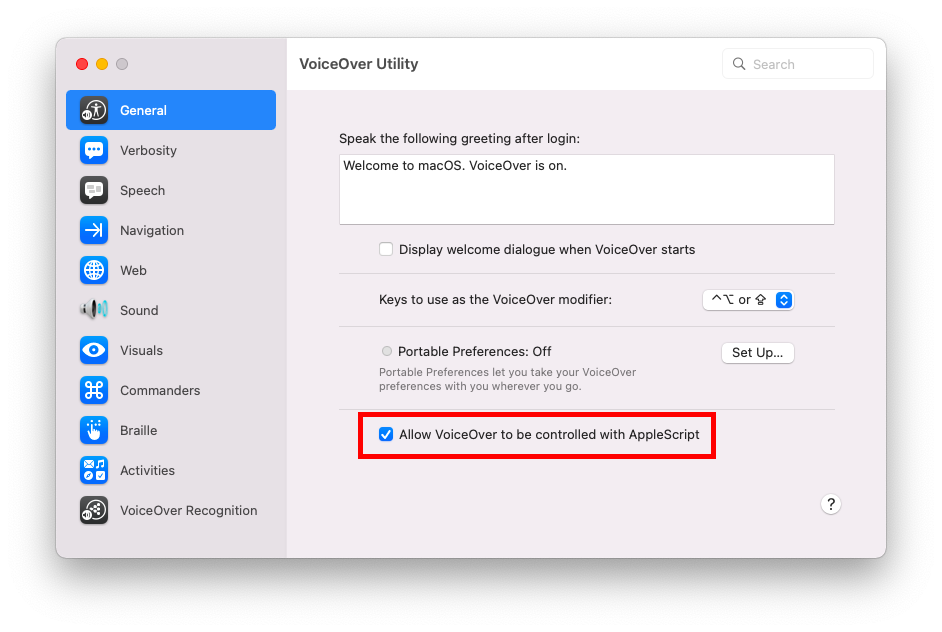
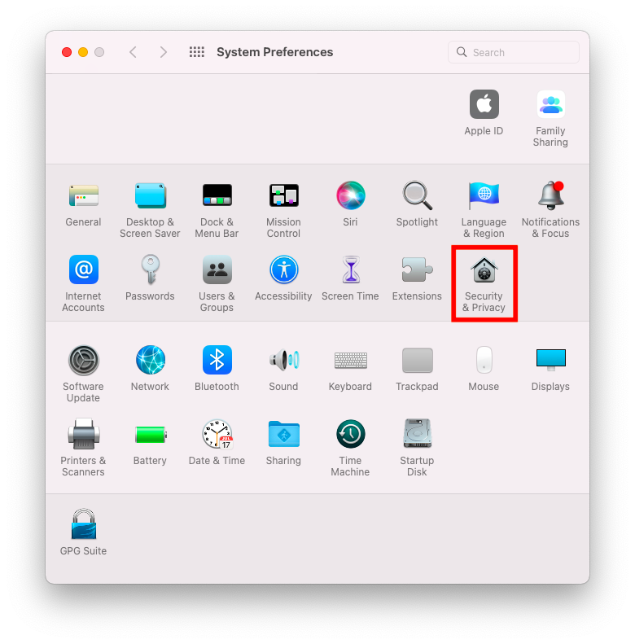
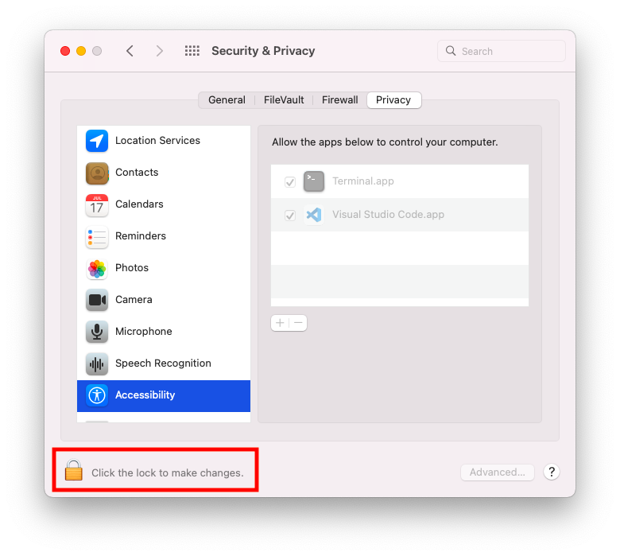
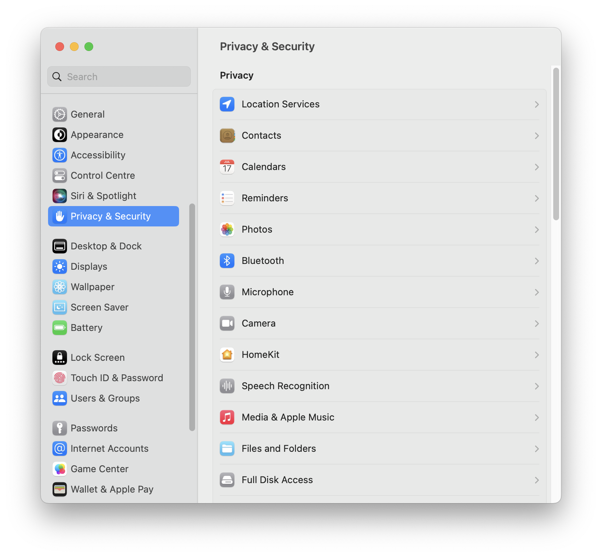
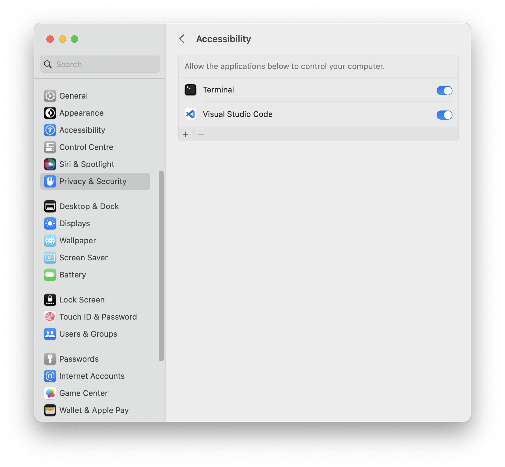
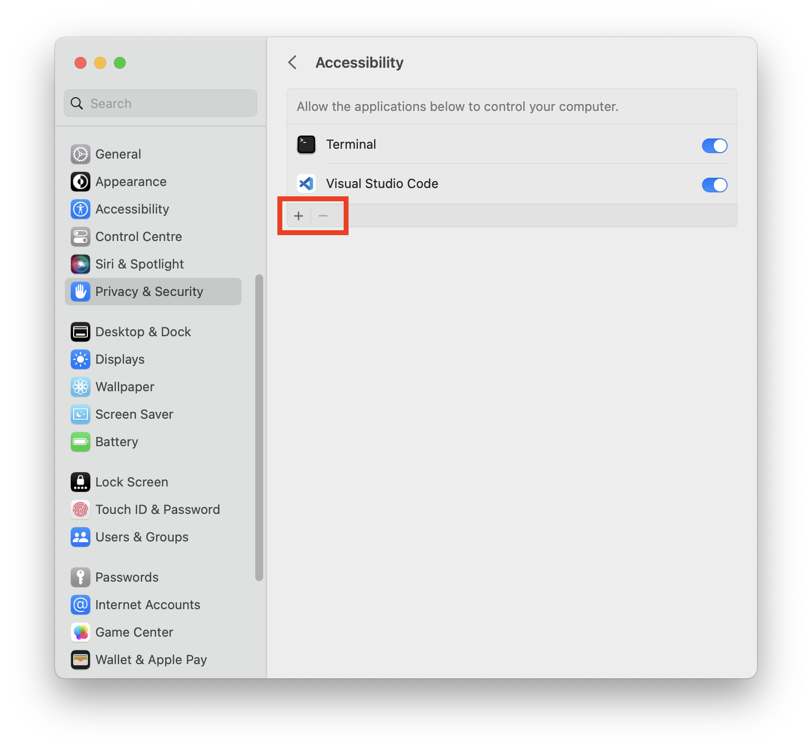

import Tabs from "@theme/Tabs";
import TabItem from "@theme/TabItem";

If [`@guidepup/setup`](https://github.com/guidepup/setup) cannot be used for your MacOS workflow, these guides instruct how to setup your MacOS environment manually for VoiceOver automation.

## Local Setup

### Allow VoiceOver To Be Controlled

This setup is required to allow VoiceOver to be controlled by Guidepup.

1. Open the "VoiceOver Utility" application.

   

2. On the "General" tab, tick the checkbox "Allow VoiceOver to be controlled with AppleScript".

   

### Allow App Automation

This setup is required to allow applications, e.g. your terminal or IDE, to control other applications, i.e. VoiceOver:

<Tabs
  groupId="env-flavor"
  defaultValue="12"
  values={[
    {label: 'MacOS 12 - Monterey', value: '12'},
    {label: 'MacOS 13 - Ventura', value: '13'}
  ]
}>
<TabItem value="12">

1. Open the "Security & Privacy" application within "System Preferences". Choose the "Privacy" tab.

   

2. Select the "Accessibility" option and click on the padlock to unlock configuration. This will require you to enter an admin username and password.

   

3. In the "Allow the apps below to control your computer." section, use the plus "+" button to add any application that you will run a Guidepup script from - this will likely be your preferred terminal or IDE. Ensure you have also ticked the checkbox next to each application that you will run a Guidepup script from.

   

</TabItem>
<TabItem value="13">

1. Open the "Privacy & Security" pane within "System Settings".

   

2. Select the "Accessibility" option.

   

3. In the "Allow the applications below to control your computer." section, use the plus "+" button to add any application that you will run a Guidepup script from - this will likely be your preferred terminal or IDE. This will prompt you for an administrator password. Ensure you have also ticked the checkbox next to each application that you will run a Guidepup script from.

   

   

</TabItem>
</Tabs>

### Additional System Permissions

Depending on how you use Guidepup you may require additional "Security & Privacy" updates with "System Preferences":

- "Location Services"
- "Microphone"
- "Screen Recording"
- "Bluetooth"
- "Automation"

While using Guidepup if a system permission is required a dialog box will pop up automatically asking for the permission. Alternatively you can proactively set these permissions in the same way as the "Accessibility" settings were updated in the previous step.

## CI Setup

### Allow VoiceOver To Be Controlled

For VoiceOver to be controlled by AppleScript the following needs to be run:

```bash
# Create VoiceOver database file specifying automation is enabled
sudo bash -c 'echo -n "a" > /private/var/db/Accessibility/.VoiceOverAppleScriptEnabled'

# Update system preference defaults specifying automation is enabled
defaults write com.apple.VoiceOver4/default SCREnableAppleScript -bool true
```

> **Note:** for the `.VoiceOverAppleScriptEnabled` file to be created you must first disable "SIP". This can only be performed whilst in Recovery Mode. Please refer to the [Apple documentation](https://developer.apple.com/documentation/security/disabling_and_enabling_system_integrity_protection) for more details.

### Allow App Automation

In order for applications (e.g. a CI terminal) to control other applications (e.g. VoiceOver) using AppleScript, updates need to be made to the `TCC.db`.

Please refer to the following examples of how to update the `TCC.db` for your desired application(s):

- [@guidepup/setup](https://github.com/guidepup/setup/blob/main/src/macOS/updateTccDb.ts) - Guidepup `TCC.db` setup
- [actions/virtual-environments](https://github.com/actions/virtual-environments/blob/main/images/macos/provision/configuration/configure-tccdb-macos11.sh) - GitHub Actions `TCC.db` setup
- [CircleCI-Public/macos-orb](https://github.com/CircleCI-Public/macos-orb/blob/main/src/commands/add-uitest-permissions.yml) - CircleCI MacOS Orb `TCC.db` setup

> **Note:** for system TCC.db updates you must first disable SIP. This can only be performed whilst in Recovery Mode. Please refer to the [Apple documentation](https://developer.apple.com/documentation/security/disabling_and_enabling_system_integrity_protection) for more details.
